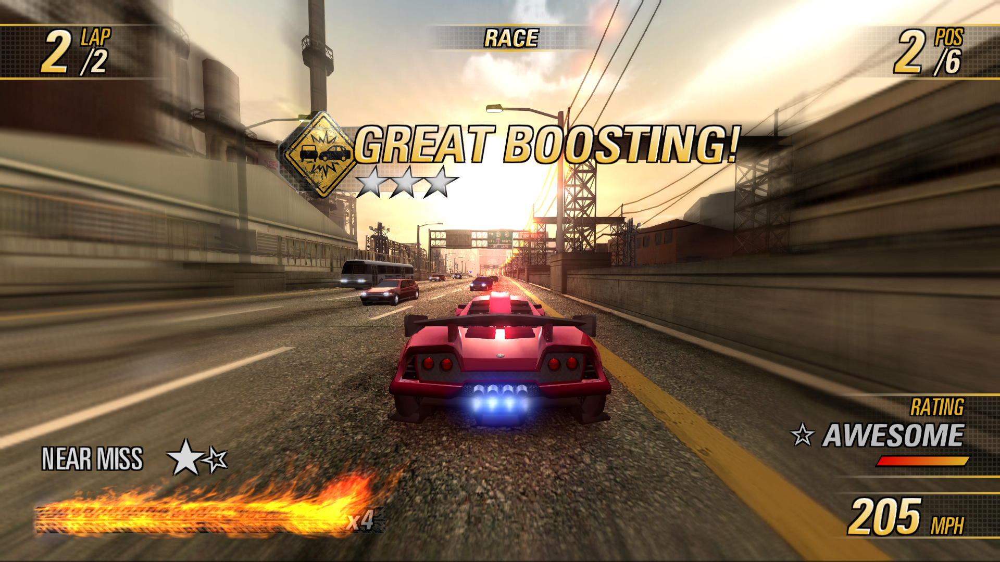
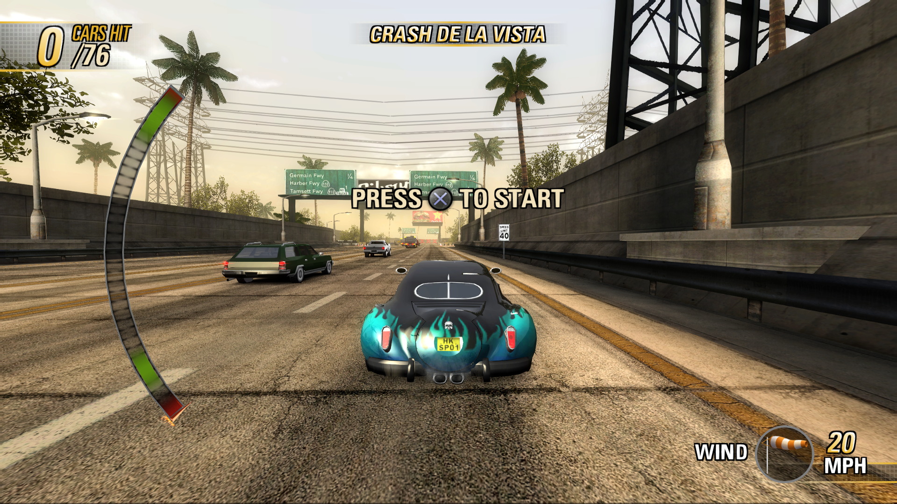
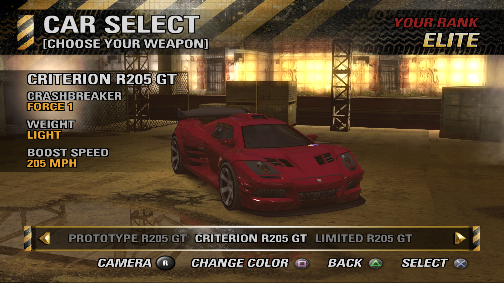
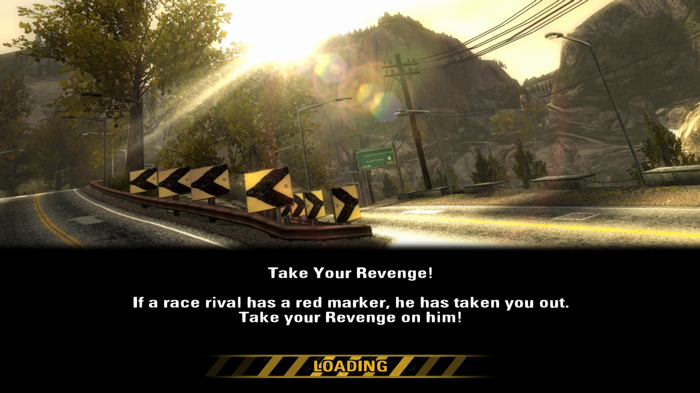
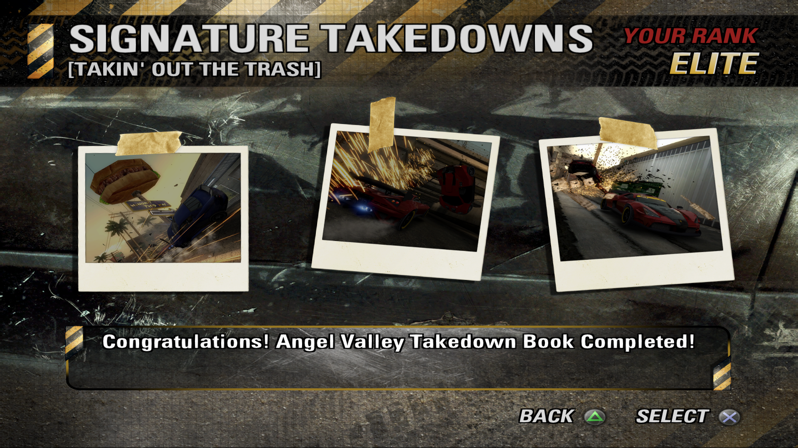
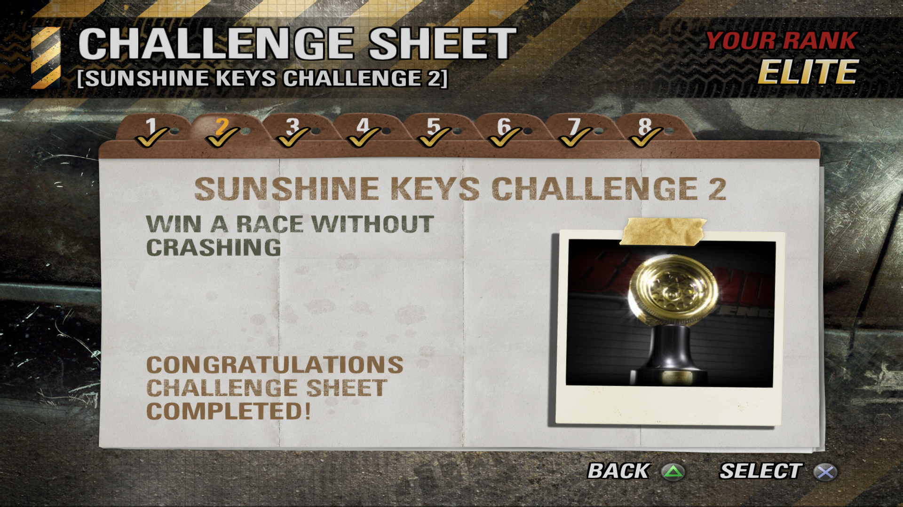
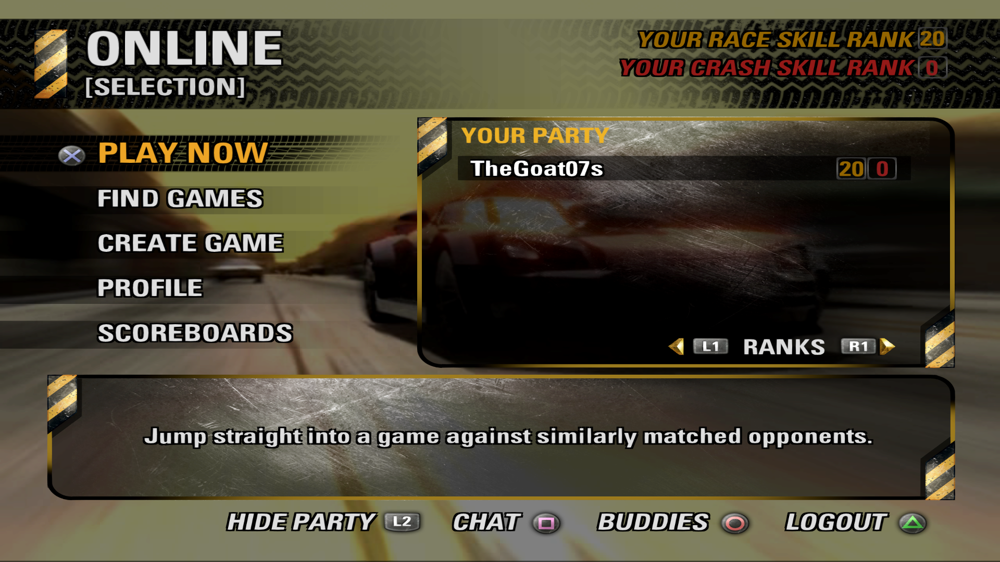

# Revenge-Enhanced-Interface
by ZenoSevens (TheGoat07s)

Aiming to enhance all UI textures of Burnout Revnege's Interface.

(This pack also supports Nahelam's Single Event Mod)

> [!IMPORTANT]
> This texture pack is intended for PCSX2.
> 
> Only tested on SLUS-21242.
>
> Installation:
> * Simply drag and drop the "replacements" folder to "PCSX2\textures\SLUS-21242".
> * Set "Load Textures" to "On" under the "Texture Replacement" tab.

> [!NOTE]
> To do :
> * Recreate satellite images
> * Controller and button icons (Other than PS2)
> * Online textures (Partially completed but majority should be covered)
> * Car renders for loading screens (In place for them as of now are in-game screenshots)
>
> Do let me know if there are any UI elements that I missed apart from what I've mentioned above.

### Screenshots

