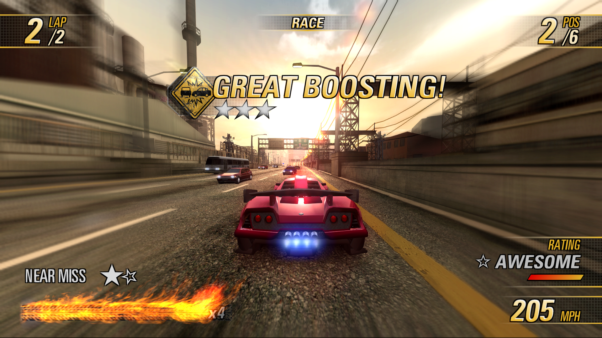
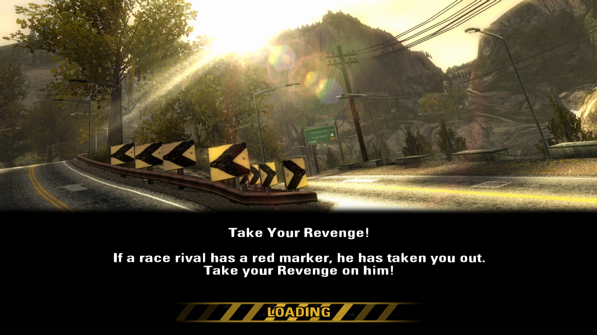
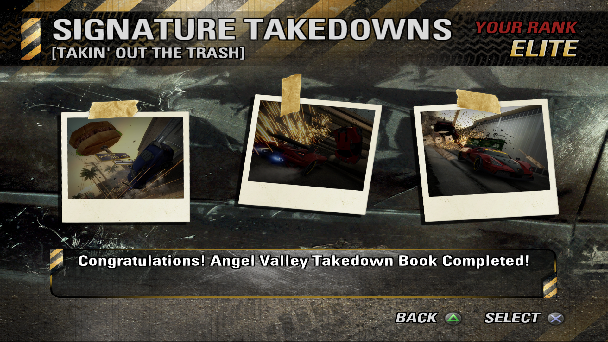
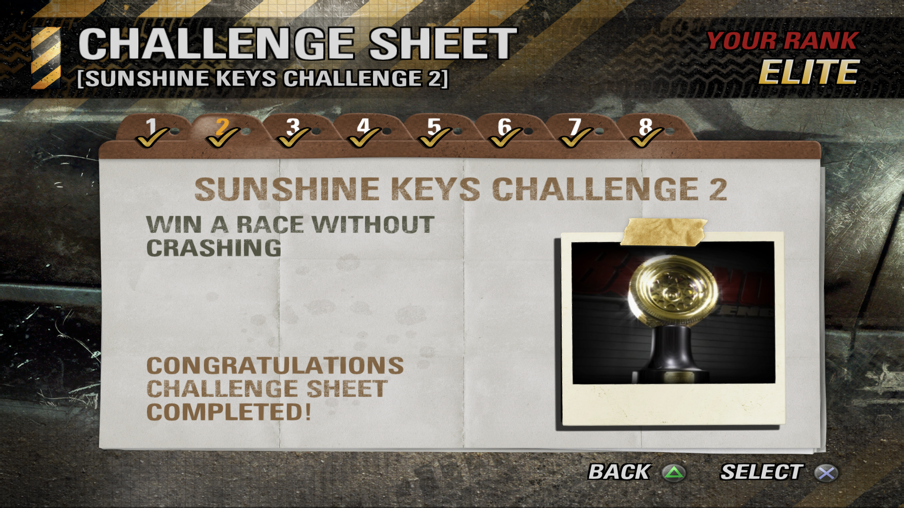

# Revenge-Enhanced-Interface
by TheGoat07s

Aims to enhance all textures of Burnout Revnege's Interface

(This pack also supports Nahelam's Single Event Mod)

> [!IMPORTANT]
> This texture pack is intended for PCSX2
> 
> Only tested on SLUS-21242
>
> Installation:
> * Simply drag and drop the "replacements" folder to PCSX2\textures\SLUS-21242

> [!NOTE]
> To do :
> * Recreate satellite images
> * Gamepad icons (other than PS2)
> * Improve flame texutures
> * Online textures (UI elements found in online mode, including buttons)
>
> Do let me know if there are any UI elements that I missed apart from what I've mentioned above.

### Screenshots

